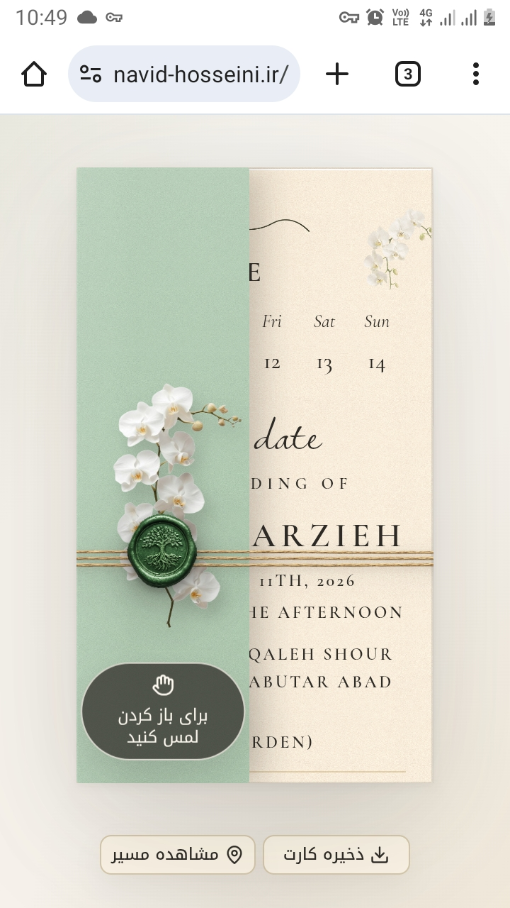
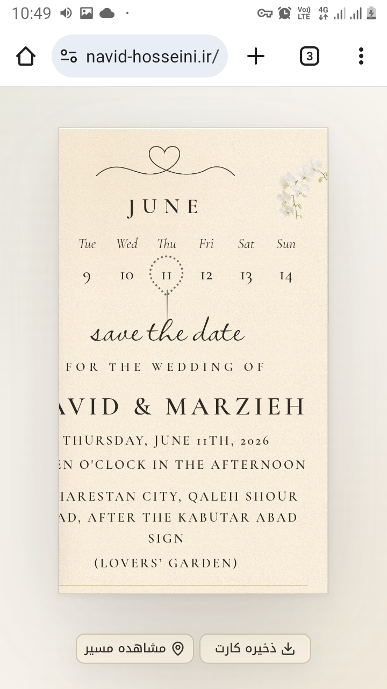

# لیست تغییرات و رفع باگ‌های UI

امیر جان، این چندتا مورد رو لطفاً چک کن که سیستم بیاد روی روال:

### ۱. مشکلات ریسپانسیو (Responsive)

*   **اسکرین‌شات:** 

*   **توضیحات:** این بخش هنوز توی گوشی‌هایی که رزولوشنشون پایینه. لطفاً یه نگاهی به مدیای این قسمت بنداز ببین کجاش داره اذیت می‌کنه.

### ۲. اصلاحات کارت (Card UI)
*   **اسکرین‌شات:** 

**تغییرات مورد نیاز:**

*   **مهر سبز:** این مهر الان افتاده وسط ساقه گل، لطفاً بیارش بالاتر، دقیقاً روی نقطه شروع (ساقه).
*   **دکمه‌های پایین:** فاصله دکمه‌ها تا زیر کارت خیلی زیاده؛ می‌خوام کاملاً بچسبن به زیر کارت و فقط یه مارجین منطقی داشته باشن.
*   **آیکون:** یه آیکون "قطع آهنگ" (Mute) هم کنار دکمه‌های پایین اضافه بشه.
*   **گل اضافه:** اون گلی که بالا سمت راست نامه هست، یکی دیگه هم دقیقاً مشابهش اضافه کن روی همون عرض کارت (همون‌جایی که با خط قرمز مشخص کردم ، یا طبق صحبتمون کلا جایگزینش کن).

دمت گرم سالار!